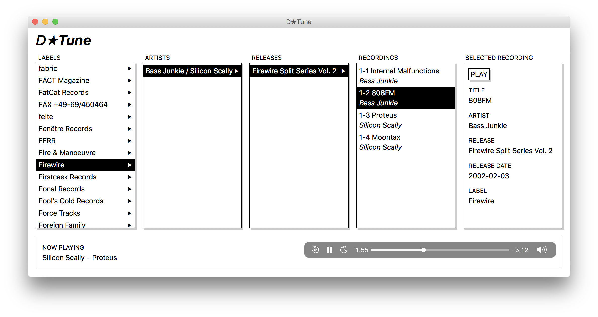

# D★Play

_D★Play_ is a highly experimental :warning: music player.

**Why does this project exist?** In order of priority:

1. I want to learn how to do frontend development properly, 2018-style.
2. I want a new hobby project.
3. I’m dissatisfied with existing music players for my NAS.

## Requirements

* Node
* Ruby
    * Bundler

## Install dependencies

* in `backend/`, run `make`
* in `frontend/`, run `make`

## Configure

Set the configuration in `backend/.env` (use `.env.sample` as inspiration).

Probably also change the (hardcoded) URL for the server in `frontend/src/index.js`. Sorry.

## Build music library (index)

Inside the `backend` directory:

1. Run `bin/fetch -m /mnt/music -c data/raw.csv`
2. Run `bin/import -c data/raw.csv -d data/music.db`

## Run

* In `backend`, run `make run`
* In `frontend`, run `make run`
